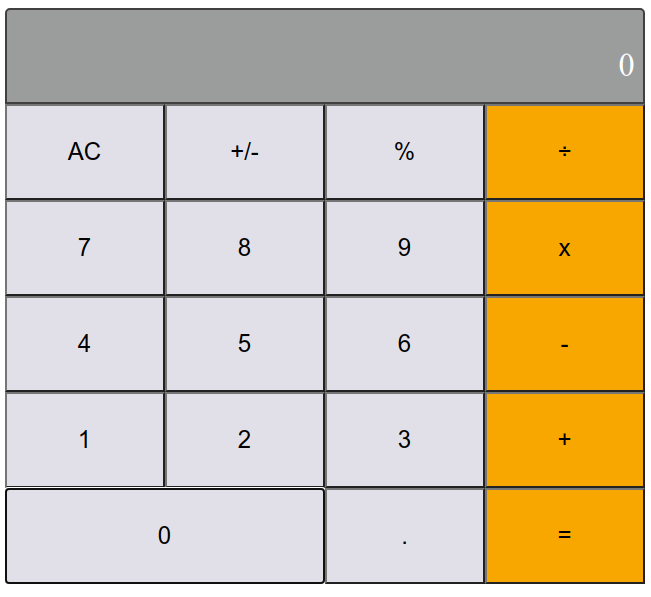

# React Calculator Project
The first milestone deals with the project environment setup. The second milestone involves creating basic components that made up the calculator. The components are Button, ButtonPanel, and Display which are located in the components folder within the src directory at the root of the project. The App component contains both the Display and ButtonPanel components which define the user interface of the calculator. The Display component will display the result of each calculation. The ButtonPanel contains the different buttons specified in the simple calculator app. In the fourth milestone, the calculator logic was implemented in the calculate and operate modules located in the logic directory. The calculate function performs the calculation using the button name and the current object state passed to it as an argument. In the final milestone, all the components and functions are connected to fully implement the calculator functionality. On clicking each button, the ButtonPanel component receives handleClick as a clickHandler property. It implements handleClick function which takes buttonName as an argument and returns clickHandler from props. clickHandler property is passed to each button in the panel. The Button component implements the handleClick function and takes the name and clickHandler as arguments. It also implements handleClick function by passing name to clickHandler. Final styling of the calculator UI was also implemented in this milestone.

The Display component calls the showResult function passing the object state to it. The showResult function uses the object state to validate and return the equivalent result on the calculator display as shown in the picture. All buttons are working as expected, However, this project can still be improved by adding more features.

## Preview


## Features
- Handles Addition.
- Handles Subtraction.
- Converts number to percentage.
- Computes multiplication.
- Computes division.
- Clears screen when needed.
- Has accuracy up to 16 places of decimal.

## Project SetUp
Get a local copy of the file. Clone with HTTPS following the steps below.

### For Windows
- In your search box, type cmd, click on cmd to open the command prompt.

### For Linux, Mac OS
- In your search box, type terminal, click on the terminal to launch it.

- Copy and paste the command below in your terminal and press enter from your keyboard.
```
git clone https://github.com/Zubenna/calculator-react.git
```
## Access Project Folder 
- Depending on where the project files are downloaded to, either Hard Disk(HDD), Desktop or Documents directory in your computer after completing the step above.
- Double click on the folder calculator to open it.
- Inside the folder, right-click and click on terminal or cmd depending on your Operating System to open it.

## Set Up Project Locally in Your Computer
- In the cmd or terminal, type the command below;
```
npm install
```
- Wait for some time to install all the app packages.
- Once the installation is completed.
- Type the command below in your cmd or terminal to start the project locally. Wait for some time.
```
npm start
```
- Once the server is fully started, you will see the project opening a different tab on your browser at port http://localhost:3000/. The page now displays the calculator app built with react.js. You can use the calculator now.

## Calculator Logic
Two files, calculate.js and operate.js are created inside the logic directory. The calculate.js takes two arguments, an object, calcData, and buttonName. The calcData object has total, next, and operation as properties. This function manipulates the properties of the calcData object using the buttonName supplied to it. If the buttonName includes any of ['+', '-', '÷', 'X', '%'], It calls the operate.js function which will use the operation name to calculate the total using the Big.js methods. The operate function implements basic mathematical calculation which includes percentage, multiplication, division, addition, and subtraction.

## Live Version
Launch live version.
- [Launch App](https://calculator-zubenna.herokuapp.com/)

## Built With
- JavaScript
- React.js
- CSS
- Notable Packages, Big.js, etc

## Author
👤 **Nnamdi Emelu**
- Github: [zubenna](https://github.com/zubenna)
- Twitter: [@zubenna](https://twitter.com/zubenna)
- Linkedin: [nnamdi-emelu](https://www.linkedin.com/in/nnamdi-emelu/)

## 🤝 Contributing
Contributions, issues, and feature requests are welcome!
Feel free to check the [issues page](https://github.com/Zubenna/calculator-react/issues/new)

## 👍 Show Your Support
Kindly star ⭐️ this project, if you like it!

## :clap: Acknowledgements
- [Microverse](https://www.microverse.org/)

## 📝 License
This project is [MIT](./LICENSE) licensed.
